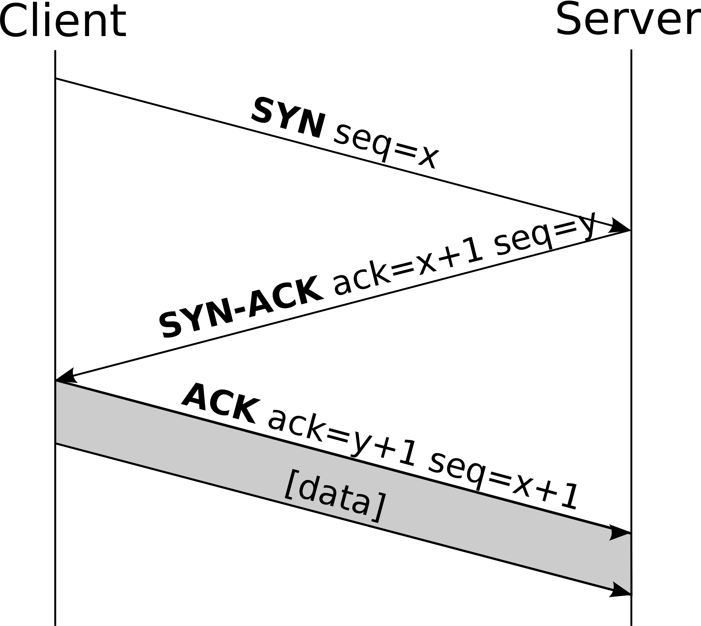

# [fit] Intro to Networking
## TCP, HTTP, and APIs - oh my!
### Andrew Kerr | October 20, 2015
### me@andrewjkerr.com

---

## whoami

---

## whoami

- Fifth year Software Engineering @ UF

---

## whoami

- Fifth year Software Engineering @ UF
- Secretary of UFSIT for > 2yrs

---

## whoami

- Fifth year Software Engineering @ UF
- Secretary of UFSIT for > 2yrs
- Full stack web developer

^ Primarily on Rails; loved security, but liked dev

---


## whoami

- Fifth year Software Engineering @ UF
- Secretary of UFSIT for > 2yrs
- Full stack web developer
- Former security intern at Tumblr

^ Turns out you can do both!

^ Worked on TFA enhancements, Content-Security-Policy, patching vulnerabilities, and more!

---


## whoami

- Fifth year Software Engineering @ UF
- Secretary of UFSIT for > 2yrs
- Full stack web developer
- Former security intern at Tumblr
- Former intern at BlockScore

^ Security specifics - audit for auth bypass, TFA, rate limiting

---

## Topics

^ We've got a lot...........

---

## Topics

- Networking layers

^ Conceptual, but helps us with talking about networking

---

## Topics

- Networking layers
- Wireshark

^ Super duper awesome packet sniffer

---

## Topics

- Networking layers
- Wireshark
- TCP

^ Popular protocol

---

## Topics

- Networking layers
- Wireshark
- TCP
- HTTP

^ How the web works

---

## Topics

- Networking layers
- Wireshark
- TCP
- HTTP
- APIs

^ Gotta access info somehow

---

## Tools

^ You'll need these later...

---

## Tools

- Wireshark
- Google Chrome
- cURL
- Postman

---

## Networking Layers

^ In order to talk about networking, we should have a conceptual model to go off of
A few of these, but OSI is what I like

---

## OSI Model

---

## The OSI model is a __conceptual__ model!

---


^ Broken up into 7 layers
^ Lowest layer is physical - electrical specification!! Relationship between the device and physical transmission medium (fiber, etc)
^ Data link is layer 2 - the link between two directly connected nodes
^ Network is layer 3 - functional and procedural means of transferring data from node to node on same network
^ Transport is layer 4 - functional and procedural means of transferring data from node to node on one or more networks
^ Session is layer 5 - controls connections between computers/servers
^ Presentation is layer 6 - provides context between different application layer entities
^ Application is layer 7 - the layer we interact with!

---

## The layers work together to network your computer to the world

^ With that being said...

---

## How do we send data back and forth?

---


^ Keep in mind - 1s and 0s!

---

## The Past:

- Dial-up modem would translate 1s and 0s into tones

---

## The Past:

- Dial-up modem would translate 1s and 0s into tones
- Receiving modem would decode 1s and 0s and change it back into data

---

## Why doesn't this work now?

^ Anyone?

---

## Too much data!

---

## Too much data!
### (Aka, you kids and your Netflix and chill)

^ Limited speed and bandwidth caused issues

---

## What do we do now?

---

## Fiber!!

^ It's great isn't it?
^ Light!

---

## Ok, but how do we send data?

^ It's great isn't it?

---

## Packets and segments!

---

## Packets

- Formatted unit of data

^ We break up the data into chunks which go into packets!

---

## Packets

- Formatted unit of data
- Carried by a network

---

## Packets

- Formatted unit of data
- Carried by a network
- Control information and payload

^ An example is...

---

## IPv4 Packets


^ Internet Protocol

---


^ Note source/dest address
^ Control info up top
^ Payload is the data which is...

---

## Layer 4 Segments

^ TCP or UDP
^ Focus on TCP today

---

## TCP
### (Segments)

^ Segments, not packets!

---

## TCP Segments

- "Transmission Control Protocol"

---

## TCP Segments

- "Transmission Control Protocol"
- Ordered

---

## TCP Segments

- "Transmission Control Protocol"
- Ordered
- Error checked

---

## TCP Segments

- "Transmission Control Protocol"
- Ordered
- Error checked
- Accepts a data stream and breaks it into chunks

^ So... what does this look like?

---


^ Notice src/dst PORT
^ Sequence/ack number (ordered)
^ Checksum (error checked)

---

## Putting it all together...

---

## TCP/IP

- Work together to transfer data!

---

## TCP/IP

- Work together to transfer data!
- IP packet has source/destination IP, TCP segment has source/destination port

---

## TCP/IP

- Work together to transfer data!
- IP packet has source/destination IP, TCP segment has source/destination port

^ We'll look at these in Wireshark in a bit

---

## TCP Handshake

---

## TCP Handshake

- A "three way handshake" before a client connects to a server

---

## TCP Handshake

- A "three way handshake" before a client connects to a server
- Must be completed before data is exchanged

---



^ SYN
^ SYN-ACK
^ ACK
^ Look at syn/acks!

---

## Cool dude, but how do I load my Tumblr dashboard?!

---

## Cool dude, but how do I load my Twitter timeline?!

---

## Cool dude, but how do I load my Facebook newsfeed?!

---

## Cool dude, but how do I load my pictures of funny cats?!

---

## Cool dude, but how do I load my pictures of cute cats?!

---

## Or, basically...

---

## How do we interact with things on the web?

---

## Hypertext Transfer Protocol

---

## Hypertext Transfer Protocol
## (HTTP)

---

## Hypertext Transfer Protocol (HTTP)

- Provides methods (verbs) that we can perform

---

## Hypertext Transfer Protocol (HTTP)

- Provides methods (verbs) that we can perform
- Defined GET, POST, and HEAD in HTTP/1.0

---

## Hypertext Transfer Protocol (HTTP)

- Provides methods (verbs) that we can perform
- Defined GET, POST, and HEAD in HTTP/1.0
- Added OPTIONS, PUT, DELETE, TRACE, and CONNECT in HTTP/1.1

---

## Hypertext Transfer Protocol (HTTP)

- Provides methods (verbs) that we can perform
- Defined __GET__, __POST__, and HEAD in HTTP/1.0
- Added OPTIONS, __PUT__, __DELETE__, TRACE, and CONNECT in HTTP/1.1

---

## How does HTTP work?

---

## How does HTTP work?

1. Client makes a request

---

## How does HTTP work?

1. Client makes a request

```
Accept:text/html,application/xhtml+xml,application/xml;q=0.9,image/webp,*/*;q=0.8
Accept-Encoding:gzip, deflate, sdch
Accept-Language:en-US,en;q=0.8,es;q=0.6,sl;q=0.4
Cache-Control:no-cache
Connection:keep-alive
DNT:1
Host:ufsit.org
Pragma:no-cache
Upgrade-Insecure-Requests:1
User-Agent:(trimmed)
```

---

## How does HTTP work?

1. Client makes a request
2. Server responds!

---

## How does HTTP work?

1. Client makes a request
2. Server responds!

```
Access-Control-Allow-Origin:*
Cache-Control:max-age=600
Content-Encoding:gzip
Content-Type:text/html; charset=utf-8
Date:Tue, 20 Oct 2015 07:24:25 GMT
Expires:Tue, 20 Oct 2015 07:34:25 GMT
Last-Modified:Mon, 19 Oct 2015 22:56:06 GMT
Server:GitHub.com
Transfer-Encoding:chunked
```

---

## Ok, Wireshark time!
